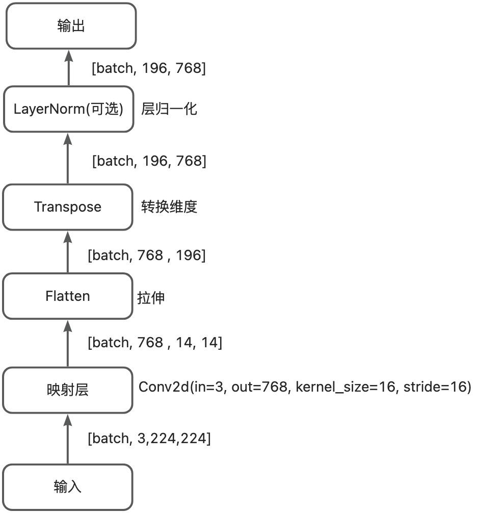

# MAE: Masked Autoencoders Are Scalable Vision Learners(CVPR2021)

说明

- 自监督学习

- 基于[Facebook官方库](https://github.com/facebookresearch/mae)，拆分出mae网络结构，注释源码以加深理解。

  > 直接断点调试models_mae.py即可

- [MAE论文精读视频-沐神](https://www.bilibili.com/video/BV1sq4y1q77t/?spm_id_from=333.337.search-card.all.click&vd_source=867a12dbe5f2199cb2f7283321debf90)
- 欢迎提issues,共同讨论！

## 整体框架

## patch_embed

图像映射为patch token

