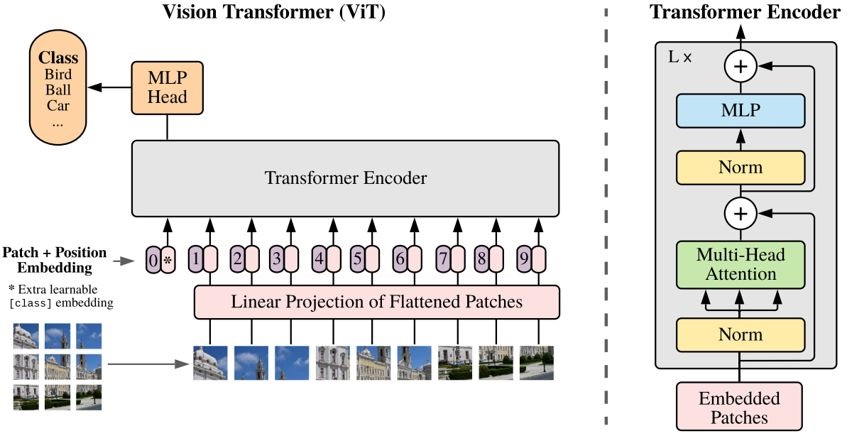
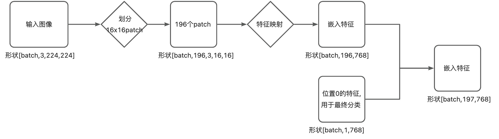
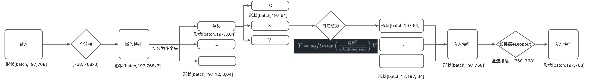
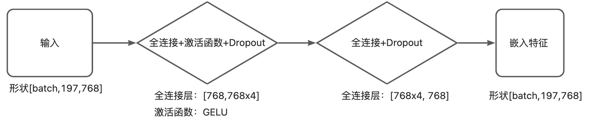
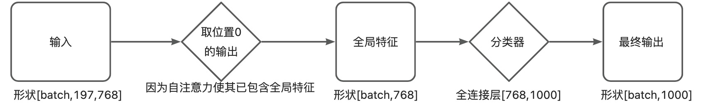

# ViT: An Image is Worth 16x16 Words: Transformers for Image Recognition at Scale

说明

- 基于[Titans模型库](https://github.com/hpcaitech/Titans)，拆分出ViT网络结构，注释源码以加深理解。
- [Transformer论文精读视频-沐神团队](https://www.bilibili.com/video/BV1pu411o7BE/?spm_id_from=333.337.search-card.all.click&vd_source=867a12dbe5f2199cb2f7283321debf90)
- [ViT论文精读视频-沐神团队](https://www.bilibili.com/video/BV15P4y137jb/?spm_id_from=pageDriver&vd_source=867a12dbe5f2199cb2f7283321debf90)
- 欢迎提issues,共同讨论！

## 整体框架

## ViTEmbedding

Linear Projection of Flattened Patches作用：线性投射层，将输入图像划分为patch，再通过线性层映射为768维token。

## Multi-Head Attention

多头自注意力作用：多个头提供模式各异的特征,类似卷积的多通道。

## MLP

作用：先升维再降维，提取深层特征。

## MLP Head  

作用：输出分类结果

### 参考
- [Vision Transformer的原理和代码解读](https://zhuanlan.zhihu.com/p/431935786)
- [Titans](https://github.com/hpcaitech/Titans)

