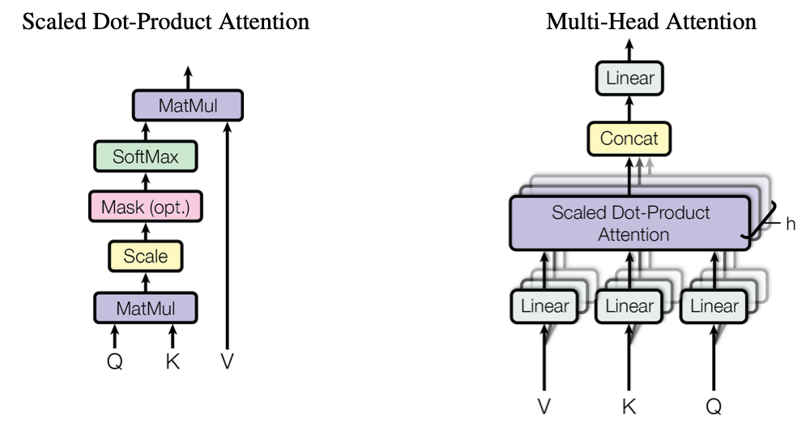

# Transformer系列解读

#### 该仓库收录于[PytorchNetHub](https://github.com/bobo0810/PytorchNetHub)

说明

- 源码注释+框架图，加深理解。

- 欢迎提issues,共同讨论！

|                          官方库                          |                         |  更新  |
| :------------------------------------------------------: | :-------------: | :----: |
| Vision Transformer(ICLR 2021) | Transformer首次应用到视觉领域    [解读+代码](./ViT/readme.md)  | 2022.12 |
| [MAE(CVPR2021)](https://github.com/facebookresearch/mae) | 自监督学习   [解读+代码](./MAE/readme.md) | 2022.12 |

# Transformer

## MultiHeadAttention
[CrossAttention源码注释,其实就是QKV加权](Transformer/CrossAttention.py)

[MHA源码注释](./Transformer/MultiHeadAttention.py) 

